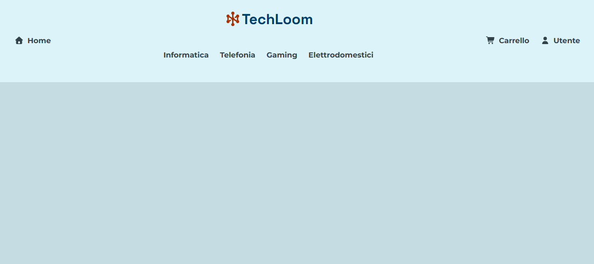
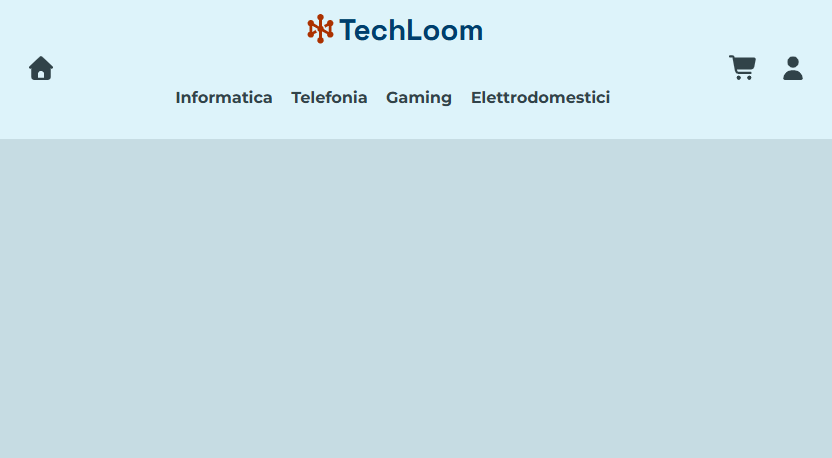
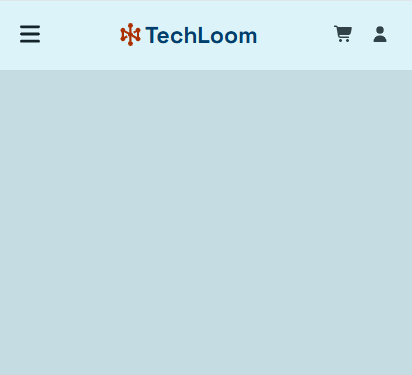
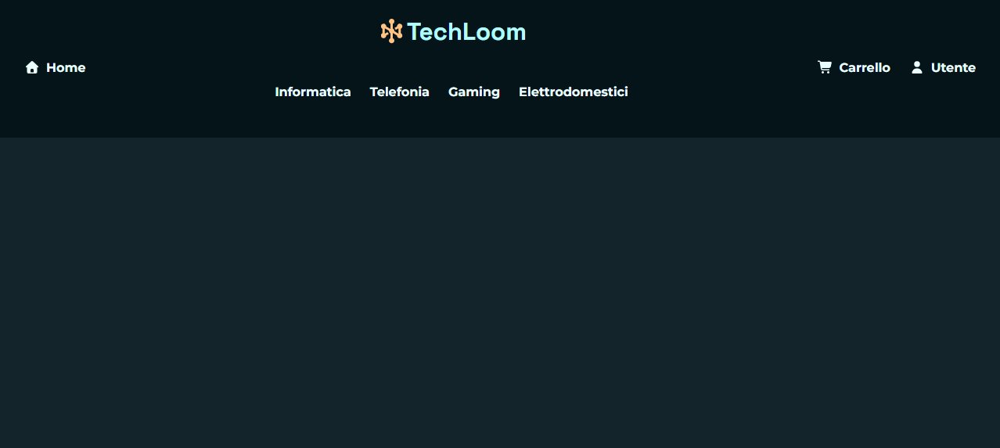

# Progetto d'Esame: Componente Header & Navbar

Questo progetto presenta un componente **Header** con **Navbar**, realizzato per un esame di Web Design. L'obiettivo era creare un componente UI personalizzato, interattivo e accessibile, seguendo i principi di un **Design System** per garantirne la riusabilità. Il componente è stato sviluppato e documentato in **Storybook**, offrendo una visualizzazione completa delle sue varianti e delle proprietà configurabili.

---

### 🎨 Principi di Design e Coerenza Visiva

Il design del componente si basa su un approccio **Atomic Design** , trattando elementi come il logo, i link di navigazione e le icone come "atomi" che si combinano per formare l'organismo del componente Header.

La palette colori è stata scelta per garantire **coerenza visiva** e un'identità chiara:

* **Celeste (`--color-trust-blue`)**: Utilizzato come colore primario per lo sfondo della navbar.
* **Giallo (`--color-vibrant-yellow`)**: Impiegato per gli stati di interazione come `hover`, attirando l'attenzione e fornendo un feedback visivo immediato.
* **Grigio (`--color-blue-gray`)**: Selezionato per il testo e le icone per assicurare una **leggibilità** ottimale e un contrasto sufficiente.

Il sistema di **spaziature** e **tipografia** è definito tramite variabili CSS, utilizzando la funzione `clamp()` per garantire una scalabilità fluida e un design adattabile tra diverse dimensioni dello schermo.

---

### ✨ Funzionalità e Caratteristiche Aggiuntive

Questo componente risponde a specifici requisiti di accessibilità e usabilità, offrendo anche un'esperienza utente moderna e adattabile:

* **Supporto per Dark Mode** 🌙: Il codice implementa la dark mode in modo intelligente, utilizzando la funzione CSS `light-dark()`. Questo approccio consente ai colori di adattarsi automaticamente in base alle preferenze del sistema operativo dell'utente (tema chiaro o scuro), senza la necessità di toggle manuali. Ad esempio, il testo del logo cambia da `--color-trust-blue-11` (modalità chiara) a `--color-trust-blue-1` (modalità scura).
* **Responsività**: Il layout si adatta a diverse dimensioni dello schermo, con un menu "hamburger" per i dispositivi mobili (sotto i 576px), garantendo una navigazione fluida su qualsiasi device.
* **Accessibilità**: Elementi come i pulsanti del menu (`hamburger-menu` e `close-menu-button`) utilizzano le etichette `aria-label` per essere comprensibili agli screen reader. Il contrasto dei colori è ottimizzato per il rispetto delle linee guida **WCAG AA**.
* **Gestione dello Stato**: Il componente gestisce i vari stati di interazione dei link (`selected`, `default`, `hover`, `focus`), evidenziando l'elemento attivo e fornendo un feedback visivo chiaro per migliorare la user experience.

---

### ⚙️ Struttura del Progetto

Il codice è organizzato in componenti logici che seguono i principi dell'Atomic Design:

* **Atomi (`Atoms`)**:
    * `Icon`: Componente che gestisce tutte le icone del sistema.
    * `Logo`: Componente semplice che mostra il logo del brand.
    * `Colors`, `Spacing`, `Typography`: Storie di Storybook che documentano il Design System di base (colori, spazi e tipografia).
* **Molecole (`Molecules`)**:
    * `NavLink`: Rappresenta un singolo link con testo e/o icona.
    * `NavLinksList`: Un elenco di link di navigazione.
* **Organismi (`Organisms`)**:
    * `Navbar`: Il componente principale che integra logo e liste di link, gestendo la logica di visualizzazione e responsività.

Questa suddivisione modulare facilita la manutenzione e la riusabilità del codice.

---

### 🚀 Come Avviare Storybook

Per visualizzare e interagire con il componente, segui queste istruzioni:

1.  Clona il repository del progetto.
2.  Installa le dipendenze: `npm install`.
3.  Avvia l'ambiente Storybook: `npm run storybook`.

---

## Componente in versione desktop

## Componente in versione tablet

## Componente in versione mobile

## Componente in versione Dark-mode

